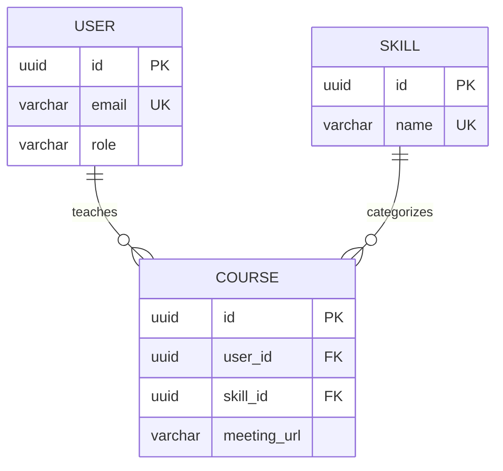

# Relational Database Lab

以 TypeORM、PostgreSQL 與 Docker 實作兩組關聯式資料庫：健身課程平台與校園成績系統。重點是把資料模型轉成可追蹤的 migration，並以可重複執行的 seeder 建立具關聯的測試資料。

這個專案適合作為 FitConnect 主專案的資料庫補充作品，展示我不只會呼叫 ORM，也理解 schema、foreign key、migration 與 seed 順序。

## 技術棧

- Node.js、JavaScript
- PostgreSQL、TypeORM EntitySchema
- Docker Compose
- Migration、Seeder
- Jest integration tests

## 兩組資料模型

### LiveFit



- `USER`：教練基本資料、唯一 email 與角色
- `SKILL`：唯一技能名稱
- `COURSE`：連結教練與技能，包含時段、名額及可空的會議連結
- Seed 順序：先 USER / SKILL，再寫入依賴兩者的 COURSE

### School Grade System

```mermaid
erDiagram
    CLASS ||--o{ STUDENT : contains
    STUDENT ||--o{ GRADE : receives
    SUBJECT ||--o{ GRADE : belongs_to
```

- `CLASS` 與 `STUDENT`：一對多
- `STUDENT` 與 `SUBJECT` 透過 `GRADE` 表達成績關係
- `GRADE` 同時保存一般成績與可空的補考成績
- 清除 seed 資料時依 foreign key 反向刪除，避免破壞參照完整性

## 專案結構

```text
.
├── livefit/
│   ├── entities/             # User、Skill、Course
│   ├── db/migrations/        # schema 版本紀錄
│   ├── db/seed.js            # 可重複建立測試資料
│   └── test/                 # 13 個驗證項目
└── school/
    ├── entities/             # Class、Student、Subject、Grade
    ├── db/migrations/
    ├── db/seed.js
    └── test/                 # 11 個驗證項目
```

## 執行方式

兩個子專案使用不同的 PostgreSQL port，可分別執行。以下以 LiveFit 為例：

```bash
cd livefit
copy .env.example .env
npm install
npm start
npm run migration:run
npm run seed
npm test
```

macOS / Linux 可將 `copy` 改成 `cp`。校園成績系統使用同樣流程，只需切換至 `school/`。

常用指令：

| 指令 | 用途 |
| --- | --- |
| `npm run migration:generate -- db/migrations/Name` | 依 entity 差異產生 migration |
| `npm run migration:run` | 套用尚未執行的 migration |
| `npm run migration:revert` | 回滾最近一筆 migration |
| `npm run seed` | 清除並重建範例資料 |
| `npm run db:reset` | 重建本機資料庫容器 |

## 我在這個專案練習到的工程能力

1. 以 entity 明確表達欄位型別、唯一性、nullable 與關聯。
2. 使用 migration 保存 schema 的演進，而不是直接修改既有資料庫。
3. 依 foreign key 關係安排 seed 與清除順序。
4. 新欄位先允許 null，避免既有資料讓 migration 失敗。
5. 用整合測試驗證資料表、constraint、relation 與 seed 結果。

## 限制與定位

這是資料庫專項練習，不包含 Web API，也不應取代完整後端作品。面試作品集建議以 FitConnect 為主，此專案用來回答「你如何設計關聯、管理 schema 版本與準備測試資料」。

> 此專案源自六角學院 Node.js 課程練習；entity、migration 與 seeder 為我的實作。
